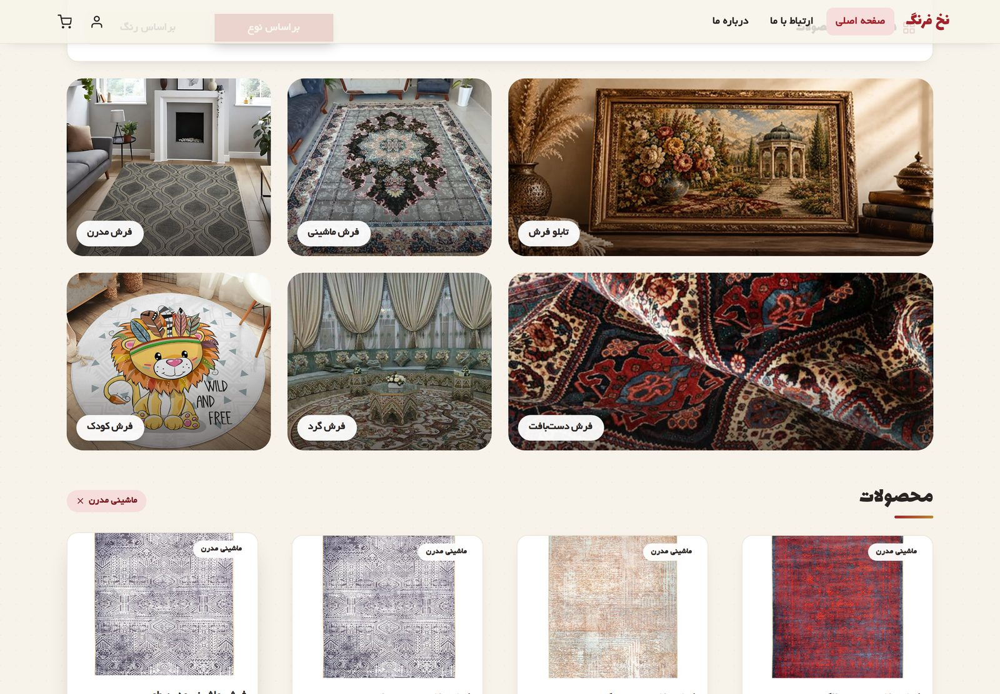
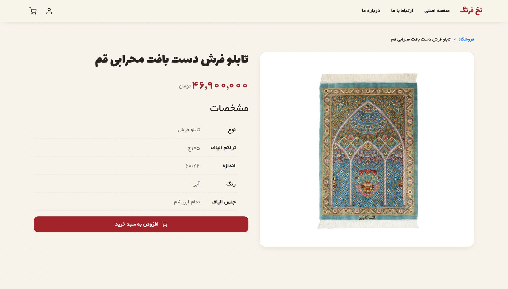
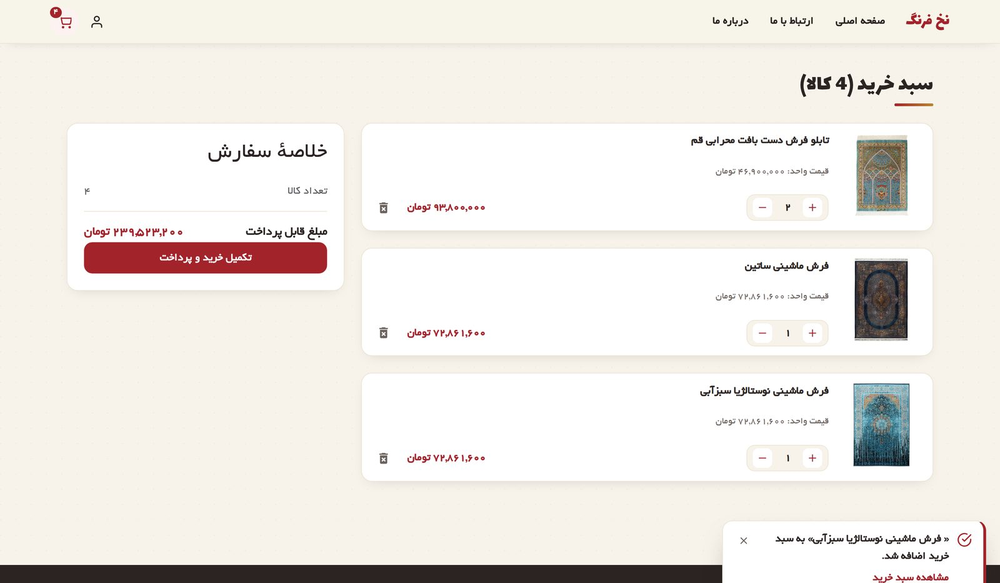

# نخ فرنگ · Nakh Farang

A responsive, right-to-left Persian carpet store built as a front-end portfolio project with **React 19**, **Vite**, **Tailwind CSS v4** and the **Context API**. Product data is served by a small REST API that runs as `json-server` in development and as Vercel Serverless Functions in production.

**[▶ Live Demo](https://carpet-store-delta.vercel.app/)** · **[Source Code](https://github.com/AhmadFiroozi/CarpetStore)** · [نسخهٔ فارسی](README.md)


---

## Features

- **Product catalogue** — 28 carpets loaded from a REST API, rendered in a responsive grid.
- **Two-dimensional filtering** — browse by carpet type (tableau, machine-made, handwoven, modern, round, kids) or by colour, with removable filter chips.
- **Product detail pages** — dynamic routes (`/Carpet/:carpetId`) with full specifications, plus a proper "not found" state for invalid IDs.
- **Shopping cart** — add items, change quantities, remove lines, running totals; the cart badge stays in sync across every page.
- **Toast notifications** — a centralised notification system with auto-dismiss, a concurrency cap and timer cleanup on unmount.
- **Loading, error and empty states** — skeleton cards while fetching, a readable message if the API fails, and a "no results" state with a reset action.
- **Full RTL layout** — Persian typography (Lalezar / Yekan), RTL Bootstrap, and localised number formatting.
- **Responsive** — from a 390 px phone to a wide desktop, including an off-canvas mobile menu.
- **Custom 404 route** for unknown paths.

| Filtering | Product page | Cart |
|---|---|---|
|  |  |  |


*The same catalogue on a 390 px viewport.*

---

## Tech Stack

| Area | Technology |
|---|---|
| Framework | React 19 |
| Build tool | Vite |
| Routing | React Router v7 (nested routes, `Layout` + `Outlet`) |
| State | Context API — separate providers for cart and notifications |
| Styling | Tailwind CSS v4 (`@theme` design tokens) + React-Bootstrap (RTL) |
| HTTP | Axios, with a single configured instance |
| API (dev) | json-server reading `db.json` |
| API (prod) | Vercel Serverless Functions reading the same `db.json` |
| Icons | react-icons |

---

## Architecture

The interesting part of this project is how the same codebase talks to two different API backends without a single conditional in the components.

```
DEVELOPMENT                          PRODUCTION (Vercel)
─────────────────────────            ─────────────────────────
Vite dev server :5173                Static build on the CDN
        │                                    │
        │  VITE_API_URL                      │  no env var set
        │  = http://localhost:3000           │  → falls back to "/api"
        ▼                                    ▼
   json-server :3000                 Serverless Functions
        │                            /api/carpets
        │                            /api/carpets/[id]
        ▼                                    │
     db.json  ◄─────── same file ────────────┘
```

Every component imports one Axios instance from `src/api.js`:

```js
const BASE_URL = import.meta.env.VITE_API_URL || '/api';
const api = axios.create({ baseURL: BASE_URL });
```

In development, `.env.development` points that at `json-server`. In production no variable is defined, so it resolves to `/api` — the Serverless Functions deployed alongside the app. Because the API lives on the same origin as the front-end, there are **no CORS issues** and no second service to keep awake.

`db.json` stays the single source of truth for both environments.

### API endpoints

| Method | Endpoint | Description |
|---|---|---|
| `GET` | `/api/carpets` | All products |
| `GET` | `/api/carpets?Type=<type>` | Filter by carpet type |
| `GET` | `/api/carpets?color=<color>` | Filter by colour |
| `GET` | `/api/carpets/:id` | A single product (404 if not found) |

### SPA routing

Client-side routes such as `/Carpet/5` must not 404 on a hard refresh, so `vercel.json` rewrites every non-API path to `index.html`:

```json
{
  "rewrites": [
    { "source": "/((?!api/).*)", "destination": "/index.html" }
  ]
}
```

The negative lookahead keeps `/api/*` reaching the Serverless Functions instead of being swallowed by the SPA fallback.

---

## Project Structure

```
CarpetStore/
├── api/carpets/          # Serverless Functions (production API)
│   ├── index.js
│   └── [id].js
├── public/images/        # Product photography
├── src/
│   ├── api.js            # Single configured Axios instance
│   ├── components/       # Card, Navbar, Products, Slider, Toast, Layout …
│   ├── context/
│   │   ├── CartContext.jsx    # Cart state and derived totals
│   │   └── ToastContext.jsx   # Notification queue and timers
│   ├── pages/            # Home, Carpet, Cart, Aboutus, ContactUs, Auth
│   ├── assets/           # Fonts and category imagery
│   └── index.css         # Tailwind v4 theme tokens
├── db.json               # Product data (shared by both API modes)
└── vercel.json           # SPA rewrite rules
```

---

## Getting Started

**Requirements:** Node.js 22.12 or newer (required by json-server; Vite accepts 20.19+).

```bash
git clone https://github.com/AhmadFiroozi/CarpetStore.git
cd CarpetStore
npm install
```

Run the API and the app in two terminals:

```bash
npm run server   # json-server on http://localhost:3000
npm run dev      # Vite on http://localhost:5173
```

Both need to be running — the app fetches its products from the API.

### Environment variables

| Variable | Development | Production |
|---|---|---|
| `VITE_API_URL` | `http://localhost:3000` (set in `.env.development`) | not set — the code falls back to `/api` |

Do **not** define `VITE_API_URL` in the Vercel dashboard; the fallback is what routes requests to the Serverless Functions.

### Other scripts

```bash
npm run build     # production build into dist/
npm run preview   # preview the build (note: /api is not served here)
npm run lint      # ESLint
```

> `vite preview` is a plain static server and does not execute the `api/` folder, so products will not load there. That path only works on Vercel.

---

## Deployment

Deployed to **Vercel** (Hobby plan). Import the repository, keep the auto-detected **Vite** preset, leave the environment variables empty and deploy — `vercel.json` and the `api/` folder are picked up automatically.

---

## Roadmap

Known gaps I plan to address next:

- **Cart persistence** — cart state is currently in memory, so a page refresh clears it. `localStorage` is the next step.
- **Search and pagination** — with 28 products the grid is manageable, but a search field and pagination are needed before it scales.
- **Combined filters** — type and colour filters currently replace each other rather than stacking.
- **Two-column product grid on small screens** to shorten the mobile home page.
- **Real authentication** — the login page is presentational only.

---

## Notes

This is a portfolio project. The store, its branding and its pricing are fictional, and the checkout button is not connected to any payment provider. Product photography is used for demonstration purposes only.

Built by [Ahmadreza Firoozi](https://github.com/AhmadFiroozi).
